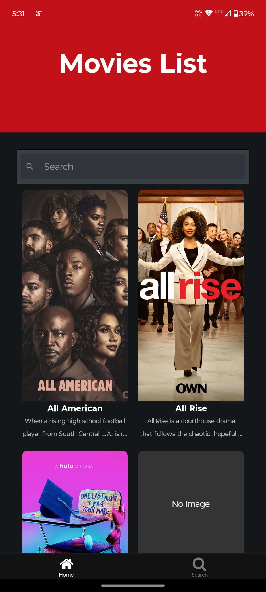
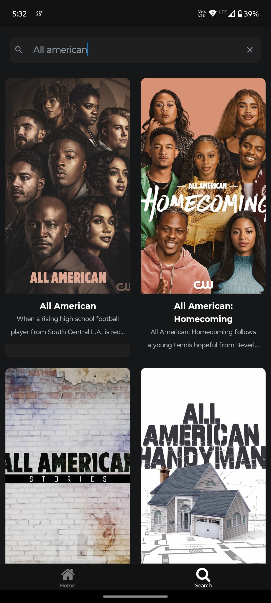
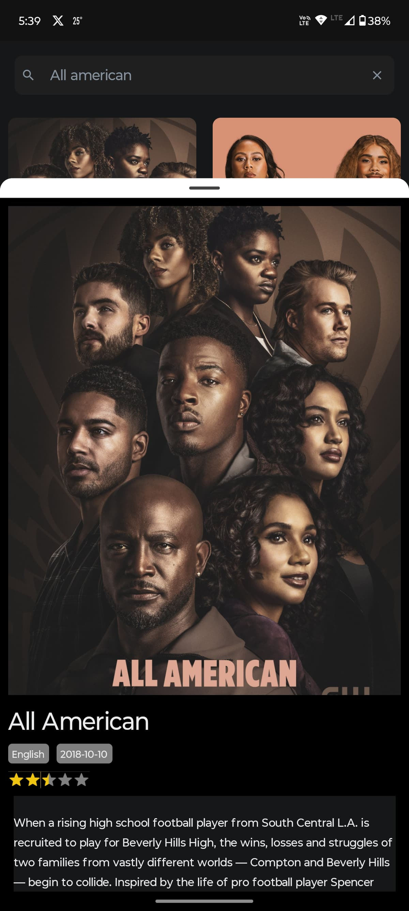

# Movie Listing App

## 📖 Project Description

An app where users can come and see all the details of a movie by just searching them.

## 📸 Screenshots

### 🏠 Home Screen


### ⚙️ Search Page


### ✨ Details Page



## 🛠️ Project Setup

Follow these steps to set up the project locally:

1. **Clone the repository:**
   ```bash
   git clone https://github.com/AmitStredz/quadB-native-project.git
   ```

2. **Navigate to the project directory:**
   ```bash
   cd quadB-native-project
   ```

3. **Install dependencies:**
   ```bash
   npm install
   ```

4. **Start the application:**
   ```bash
   npx expo start
   ```
   or
   ```
   npm run ios/android
   ```

## 🚀 Running the App

After starting the application, you can:

- Open the app in a [development build](https://docs.expo.dev/develop/development-builds/introduction/).
- Use an [Android emulator](https://docs.expo.dev/workflow/android-studio-emulator/).
- Use an [iOS simulator](https://docs.expo.dev/workflow/ios-simulator/).
- Open the app in [Expo Go](https://expo.dev/go).


